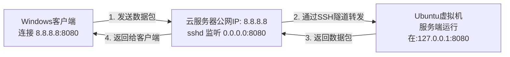

# SSH反向隧道完整配置指南

## 概述
SSH反向隧道用于让互联网上的客户端能够访问虚拟机内运行的服务端程序。

## 系统架构
```
同学Windows客户端 → 云服务器(39.106.12.91:8080) → SSH隧道 → 虚拟机服务端(127.0.0.1:8080) → MySQL数据库(39.106.12.91:3306)
```

## 📋 快速导航

### 🎯 按使用场景选择

**🔧 首次配置**：新环境完整配置
- [一、前置配置](#一前置配置) - 虚拟机环境、PEM文件、云服务器SSH配置
- [二、服务端程序配置](#二服务端程序配置) - 编译和启动服务端
- [三、建立SSH反向隧道](#三建立ssh反向隧道) - 安装autossh和建立隧道
- [四、连接测试](#四连接测试) - 本地和外部连接验证

**✅ 已完成配置的组员**：
1. 直接跳转到 [五、完整启动流程](#五完整启动流程)
2. 使用客户端连接信息：`39.106.12.91:8080`
 
**❓ 故障排除**：遇到问题时查看[六、故障排除](#六故障排除)

**📊 配置信息**：查看当前状态
- [七、数据库配置](#七数据库配置) - 数据库连接参数

- [SSH反向隧道解释](#ssh反向隧道解释) - 技术原理和详细说明


## 一、前置配置

### 1.1 虚拟机环境配置
```bash
# 安装MySQL客户端库
sudo apt-get update
sudo apt-get install libmysqlclient-dev build-essential g++

# 验证安装
ls /usr/include/mysql/mysql.h
ls /usr/lib/x86_64-linux-gnu/libmysqlclient*
```

### 1.2 PEM文件配置
```bash
# 设置PEM文件权限
chmod 400 ~/project/ubuntushare/dongRuanSystem.pem

# 验证权限
ls -la ~/project/ubuntushare/dongRuanSystem.pem
# 应该显示：-r-------- 1 lune lune 1675 date dongRuanSystem.pem
```

### 1.3 云服务器SSH配置  
**⚠️ 此部分配置已经完成，无需重复配置！**

SSH反向隧道需要两个关键配置：`GatewayPorts yes` 和 `AllowTcpForwarding yes`

**当前状态**：✅ 已配置完成
- GatewayPorts yes ✅
- AllowTcpForwarding yes ✅

**验证命令**：
```bash
ssh -i ~/project/ubuntushare/dongRuanSystem.pem root@39.106.12.91 "grep -E '(GatewayPorts|AllowTcpForwarding)' /etc/ssh/sshd_config"
```

**预期结果**：
```bash
GatewayPorts yes
AllowTcpForwarding yes
```

---

**以下配置步骤仅供参考（已执行完成）**：

SSH反向隧道需要两个关键配置：`GatewayPorts yes` 和 `AllowTcpForwarding yes`

#### 步骤1：连接到云服务器
```bash
# 连接到云服务器
ssh -i ~/project/ubuntushare/dongRuanSystem.pem root@39.106.12.91
# 这里路径需要根据具体进行修改，不要把pem文件放在项目文件中！
```

#### 步骤2：备份原配置文件
```bash
# 备份原配置文件
cp /etc/ssh/sshd_config /etc/ssh/sshd_config.backup
```

#### 步骤3：检查当前配置
```bash
# 查看当前SSH配置
grep -E '(GatewayPorts|AllowTcpForwarding)' /etc/ssh/sshd_config
```

**可能的显示结果**：
```bash
#GatewayPorts no                    # 被注释且为no
#AllowTcpForwarding yes             # 被注释
```

#### 步骤4：修改配置

**方法1：使用sed命令**
```bash
# 修改GatewayPorts：从 #GatewayPorts no 改为 GatewayPorts yes
sed -i 's/#GatewayPorts no/GatewayPorts yes/' /etc/ssh/sshd_config

# 取消AllowTcpForwarding的注释：从 #AllowTcpForwarding yes 改为 AllowTcpForwarding yes
sed -i 's/#AllowTcpForwarding yes/AllowTcpForwarding yes/' /etc/ssh/sshd_config
```

**方法2：手动编辑（如果sed命令不工作）**
```bash
# 使用nano编辑器
nano /etc/ssh/sshd_config

# 找到这两行并修改：
# 将 #GatewayPorts no 改为 GatewayPorts yes
# 将 #AllowTcpForwarding yes 改为 AllowTcpForwarding yes

# 保存并退出：Ctrl+X, Y, Enter
```

#### 步骤5：重载SSH服务
```bash
# 重载SSH配置（不重启服务）
systemctl reload ssh
```

#### 步骤6：验证配置
```bash
# 检查配置是否修改成功
grep -E '(GatewayPorts|AllowTcpForwarding)' /etc/ssh/sshd_config
```

**正确的显示结果**：
```bash
GatewayPorts yes
AllowTcpForwarding yes
```

#### 步骤7：退出云服务器
```bash
# 退出云服务器
exit
```

#### 配置说明
- **GatewayPorts yes**：允许SSH反向隧道监听所有网络接口（包括公网）
- **AllowTcpForwarding yes**：启用TCP端口转发功能
- 这两个配置都是SSH反向隧道正常工作所必需的

#### 安全提醒
- 修改前一定要备份原配置文件
- 如果配置出错，可以恢复备份：`cp /etc/ssh/sshd_config.backup /etc/ssh/sshd_config`
- 确保PEM文件权限正确：`chmod 400 ~/project/ubuntushare/dongRuanSystem.pem`
- 建议将PEM文件移动到 `~/.ssh/` 目录进行安全管理

## 二、服务端程序配置

### 2.1 启动服务端
```bash
sudo ./app 0.0.0.0 8080 3 2

# 验证服务端运行
ps aux | grep app
netstat -tlnp | grep 8080
```

## 三、建立SSH反向隧道

### 3.1 安装autossh（推荐）
```bash
sudo apt-get install autossh
```

### 3.2 建立隧道
```bash
# 在新的终端窗口中执行
autossh -M 20000 -N -R 0.0.0.0:8080:127.0.0.1:8080 root@39.106.12.91 -i ~/project/ubuntushare/dongRuanSystem.pem
```

### 3.3 验证隧道建立
```bash
# 检查隧道进程
ps aux | grep "ssh.*-R.*8080"

# 检查云服务器端口监听
ssh -i ~/project/ubuntushare/dongRuanSystem.pem root@39.106.12.91 "netstat -tlnp | grep 8080"

# 预期结果：
# tcp        0      0 0.0.0.0:8080            0.0.0.0:*               LISTEN      22174/sshd: root
# tcp6       0      0 :::8080                 :::*                    LISTEN      22174/sshd: root
```

## 四、连接测试

### 4.1 本地连接测试
```bash
# 测试虚拟机本地8080端口
telnet 127.0.0.1 8080

# 测试SSH端口（验证网络连接）
telnet 39.106.12.91 22
```

### 4.2 外部连接测试
```bash
# 在虚拟机里测试云服务器8080端口
telnet 39.106.12.91 8080

# 在Windows里测试
Test-NetConnection 39.106.12.91 -Port 8080

# 注意：如果连接被拒绝，说明需要配置云服务器安全组
# 这是正常现象，SSH隧道已建立，但外部访问被安全组阻止
```

### 4.3 客户端连接信息
```
服务器地址：39.106.12.91
端口：8080
```


## 五、完整启动流程

** 快速启动指南：如果已完成前置配置，可直接执行以下步骤！**

> **前置配置检查清单**：
> - [x] 虚拟机环境配置（MySQL客户端库已安装）
> - [x] PEM文件权限设置（chmod 400）
> - [x] 云服务器SSH配置（GatewayPorts yes, AllowTcpForwarding yes）
> - [x] 服务端程序编译完成
> - [x] autossh已安装

**如果以上配置都已完成，请直接执行下面的启动步骤** 

---

### 5.1 启动服务端
```bash
cd ~/project/ubuntushare/industrial-remote-support/server
./app 0.0.0.0 8080 3 2
```

### 5.2 建立SSH隧道
```bash
# 在新的终端窗口中执行
autossh -M 20000 -N -R 0.0.0.0:8080:127.0.0.1:8080 root@39.106.12.91 -i ~/project/ubuntushare/dongRuanSystem.pem
```

### 5.3 验证系统状态
```bash
# 检查服务端
ps aux | grep app
netstat -tlnp | grep 8080

# 检查隧道
ps aux | grep "ssh.*-R.*8080"
ssh -i ~/project/ubuntushare/dongRuanSystem.pem root@39.106.12.91 "netstat -tlnp | grep 8080"

# 测试连接
telnet 127.0.0.1 8080
telnet 39.106.12.91 8080
```

### 5.4 客户端连接信息
```
服务器地址：39.106.12.91
端口：8080
```


## 六、故障排除

### 6.1 连接失败诊断
```bash
# 检查网络连接
ping 39.106.12.91

# 检查SSH连接
ssh -i ~/project/ubuntushare/dongRuanSystem.pem root@39.106.12.91 "echo 'test'"

# 检查服务端状态
ps aux | grep app
netstat -tlnp | grep 8080

# 检查隧道状态
ps aux | grep "ssh.*-R.*8080"
ssh -i ~/project/ubuntushare/dongRuanSystem.pem root@39.106.12.91 "netstat -tlnp | grep 8080"
```

### 6.2 常见问题解决

#### 问题1：PEM文件权限错误
```bash
chmod 400 ~/project/ubuntushare/dongRuanSystem.pem
```

#### 问题2：SSH隧道断开
```bash
# 重新建立隧道
autossh -M 20000 -N -R 0.0.0.0:8080:127.0.0.1:8080 root@39.106.12.91 -i ~/project/ubuntushare/dongRuanSystem.pem
```

#### 问题3：端口被占用
```bash
# 检查端口占用
sudo lsof -i:8080

# 终止占用进程
sudo kill -9 <PID>
```

#### 问题4：云服务器防火墙
```bash
# 检查防火墙状态
ssh -i ~/project/ubuntushare/dongRuanSystem.pem root@39.106.12.91 "ufw status"
```

### 6.3 安全组配置
**需要在云服务商控制台配置**：
- 端口：8080
- 协议：TCP
- 源：0.0.0.0/0
- 描述：SSH反向隧道端口

### 6.4 常见错误和解决方案

#### 错误1：autossh警告信息
```bash
Warning: remote port forwarding failed for listen port 20000
Warning: remote port forwarding failed for listen port 8080
```
**说明**：这是autossh的监控端口警告，不影响实际功能。如果云服务器端口正常监听，说明隧道已建立。

#### 错误2：连接被拒绝
```bash
telnet 39.106.12.91 8080
# 结果：telnet: Unable to connect to remote host: 连接被拒绝
```
**原因**：云服务器安全组没有开放8080端口
**解决方案**：配置安全组

#### 验证SSH隧道是否真的建立
```bash
# 检查云服务器端口监听
ssh -i ~/project/ubuntushare/dongRuanSystem.pem root@39.106.12.91 "netstat -tlnp | grep 8080"

# 如果显示端口在监听，说明隧道已建立，问题在安全组
```

## 七、数据库配置

### 7.1 当前数据库配置
```cpp
// 在 auth.cpp 中的配置
const char* HOST = "39.106.12.91";
const char* USER = "qtuser";
const char* PASS = "QtPassw0rd!";
const char* DB_NAME = "dongRuanSystem";
const unsigned int PORT = 3306;
```

# SSH反向隧道解释
利用 **SSH 协议的端口转发功能**实现内网穿透

---

### 这个做法的核心思想

这个方案的目的是：**让你本地虚拟机里的服务端程序，能够被互联网上任意位置的客户端访问到。** 它通过 SSH 协议，在你的虚拟机（内网）和云服务器（公网）之间建立一条安全的加密“隧道”，将云服务器上的一个公开端口“映射”到你虚拟机内部的端口上。

---

### 每一步的详细解释

**第1步：虚拟机里跑服务端**
```bash
sudo ./app 0.0.0.0 8080 3 2
```
-   **含义**：在你的 Ubuntu 虚拟机中，正常启动你的服务端程序。
-   **为什么是 `0.0.0.0`**：这表示让服务端监听所有网络接口上的连接请求。这是必须的，因为接下来 SSH 转发来的连接来自于虚拟机的内部网络（`127.0.0.1`），而不是外网。

**第2步：配置云服务器的 SSH 服务**
-   **操作**：在云服务器上修改 `/etc/ssh/sshd_config` 文件，设置 `GatewayPorts yes`，然后重载配置。
-   **含义**：默认情况下，SSH 反向隧道只允许本地主机（`127.0.0.1`）访问转发的端口。这个配置选项**允许云服务器上的所有网卡（包括对公网的网卡）监听转发端口**。这样，互联网上的任何客户端才能连接到 `云服务器IP:8080`。

**第3步：建立反向隧道（最关键的一步）**
```bash
ssh -N -R 0.0.0.0:8080:127.0.0.1:8080 user@云服务器公网IP
```
这条命令是在**你的虚拟机**里执行的。我们来拆解这个命令：
-   `ssh`：调用 SSH 客户端。
-   `-N`：表示不执行远程命令。我们只是用来建立隧道，不需要打开一个远程 shell。
-   `-R`：表示建立**反向远程端口转发**。
-   `0.0.0.0:8080`：这是**在云服务器上**监听的地址和端口。`0.0.0.0` 表示监听所有接口。
-   `127.0.0.1:8080`：这是**在你的虚拟机里**的目标地址和端口。`127.0.0.1` 代表虚拟机本地。
-   `user@云服务器公网IP`：用这个账号登录到你的云服务器。

**第4步：Windows 客户端连接**
-   **操作**：在你的组员的 Windows 客户端上，“服务器地址”一栏填写云服务器的公网 IP，端口填 `8080`。
-   **含义**：客户端完全不知道你的服务端其实在别处。它以为它连接的就是云服务器上运行的服务端。而云服务器上的 SSH 服务会默默地、自动地把所有数据通过隧道转发给你的虚拟机。

---

### 整个数据流的过程



### ✅ 这个方案的优点和注意事项

**优点：**
1.  **极其简单**：不需要在云服务器上安装任何额外软件（如 frp），只用了系统自带的 SSH。
2.  **安全**：所有数据都通过 SSH 加密隧道传输。
3.  **无需修改代码**：对你的服务端和客户端程序完全透明，它们感知不到隧道的存在。

**注意事项：**
1.  **隧道稳定性**：如果 SSH 连接断开（比如虚拟机休眠、网络波动），隧道就会失效。你需要**手动重新执行第3步的命令**来重建隧道。为了解决这个问题，你可以使用 `autossh` 这个工具来代替 `ssh`，它可以自动重连。
2.  **云服务器安全**：确保你的云服务器 SSH 密码足够强大，或者最好使用密钥登录，以防被暴力破解。
3.  **防火墙**：确保云服务器的安全组（防火墙）已经放行了 `8080` 端口的入站流量。

**总结：这是一个低成本且高效的解决方案，适合项目演示和开发测试场景。** 