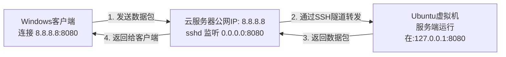

利用 **SSH 协议的端口转发功能**实现内网穿透

---

### 这个做法的核心思想

这个方案的目的是：**让你本地虚拟机里的服务端程序，能够被互联网上任意位置的客户端访问到。** 它通过 SSH 协议，在你的虚拟机（内网）和云服务器（公网）之间建立一条安全的加密“隧道”，将云服务器上的一个公开端口“映射”到你虚拟机内部的端口上。

---

### 每一步的详细解释

**第1步：虚拟机里跑服务端**
```bash
sudo ./app 0.0.0.0 8080 3 2
```
-   **含义**：在你的 Ubuntu 虚拟机中，正常启动你的服务端程序。
-   **为什么是 `0.0.0.0`**：这表示让服务端监听所有网络接口上的连接请求。这是必须的，因为接下来 SSH 转发来的连接来自于虚拟机的内部网络（`127.0.0.1`），而不是外网。

**第2步：配置云服务器的 SSH 服务**
-   **操作**：在云服务器上修改 `/etc/ssh/sshd_config` 文件，设置 `GatewayPorts yes`，然后重载配置。
-   **含义**：默认情况下，SSH 反向隧道只允许本地主机（`127.0.0.1`）访问转发的端口。这个配置选项**允许云服务器上的所有网卡（包括对公网的网卡）监听转发端口**。这样，互联网上的任何客户端才能连接到 `云服务器IP:8080`。

**第3步：建立反向隧道（最关键的一步）**
```bash
ssh -N -R 0.0.0.0:8080:127.0.0.1:8080 user@云服务器公网IP
```
这条命令是在**你的虚拟机**里执行的。我们来拆解这个命令：
-   `ssh`：调用 SSH 客户端。
-   `-N`：表示不执行远程命令。我们只是用来建立隧道，不需要打开一个远程 shell。
-   `-R`：表示建立**反向远程端口转发**。
-   `0.0.0.0:8080`：这是**在云服务器上**监听的地址和端口。`0.0.0.0` 表示监听所有接口。
-   `127.0.0.1:8080`：这是**在你的虚拟机里**的目标地址和端口。`127.0.0.1` 代表虚拟机本地。
-   `user@云服务器公网IP`：用这个账号登录到你的云服务器。

**整条命令的通俗解释就是：**
“SSH 先生，请您帮我建立一个到云服务器的安全隧道。请让云服务器对外开放它的 `8080` 端口。任何人访问这个端口，都请通过这条隧道，把数据转发给我本地虚拟机（`127.0.0.1`）的 `8080` 端口。”

**第4步：Windows 客户端连接**
-   **操作**：在你的组员的 Windows 客户端上，“服务器地址”一栏填写云服务器的公网 IP，端口填 `8080`。
-   **含义**：客户端完全不知道你的服务端其实在别处。它以为它连接的就是云服务器上运行的服务端。而云服务器上的 SSH 服务会默默地、自动地把所有数据通过隧道转发给你的虚拟机。

---

### 整个数据流的过程



### ✅ 这个方案的优点和注意事项

**优点：**
1.  **极其简单**：不需要在云服务器上安装任何额外软件（如 frp），只用了系统自带的 SSH。
2.  **安全**：所有数据都通过 SSH 加密隧道传输。
3.  **无需修改代码**：对你的服务端和客户端程序完全透明，它们感知不到隧道的存在。

**注意事项：**
1.  **隧道稳定性**：如果 SSH 连接断开（比如虚拟机休眠、网络波动），隧道就会失效。你需要**手动重新执行第3步的命令**来重建隧道。为了解决这个问题，你可以使用 `autossh` 这个工具来代替 `ssh`，它可以自动重连。
2.  **云服务器安全**：确保你的云服务器 SSH 密码足够强大，或者最好使用密钥登录，以防被暴力破解。
3.  **防火墙**：确保云服务器的安全组（防火墙）已经放行了 `8080` 端口的入站流量。

**总结：这是一个非常巧妙、低成本且高效的解决方案，特别适合你们这种项目演示和开发测试场景。** 你现在就可以去试试看！
