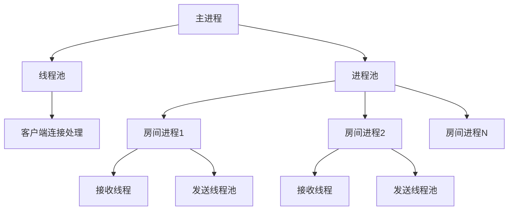
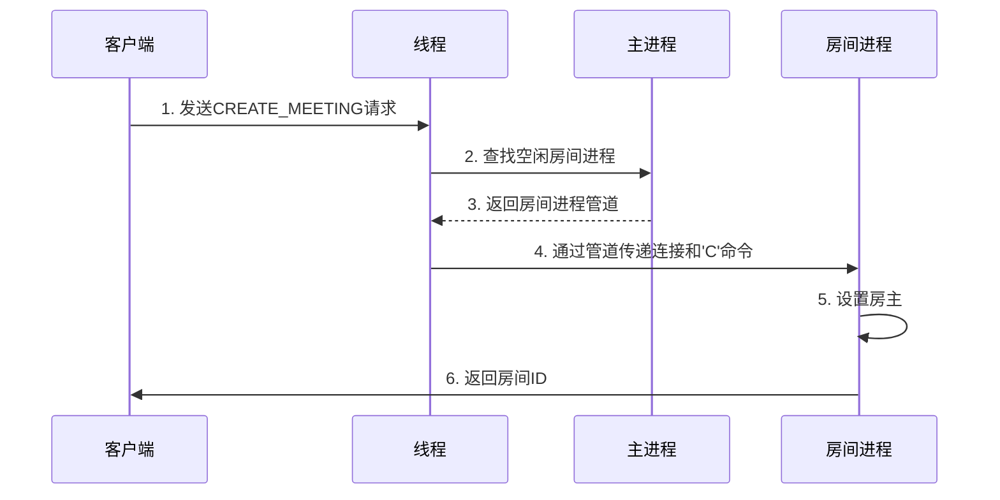
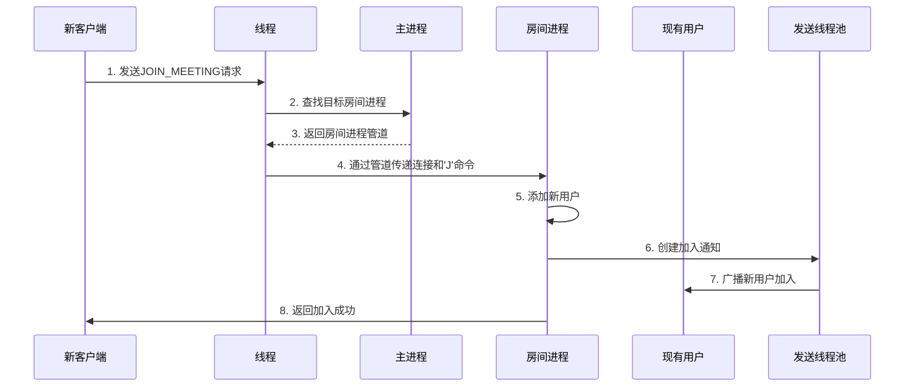
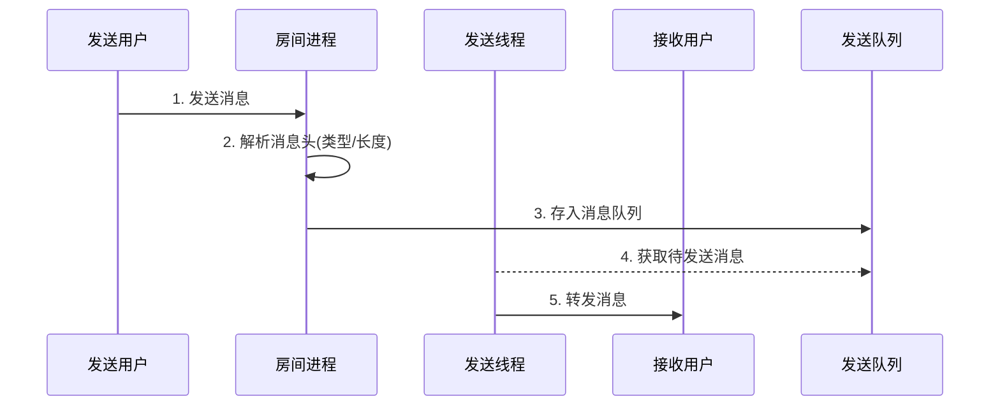
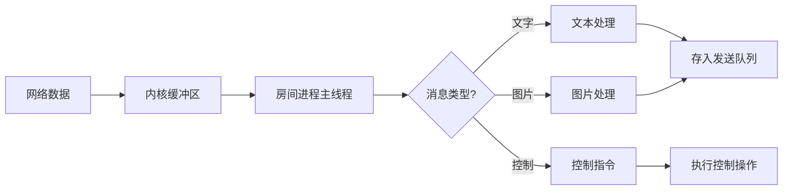
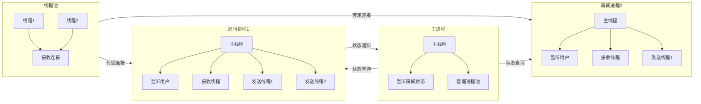

### 一、系统架构概览


### 二、创建会议室流程

#### 1. 流程步骤


#### 2. 进程/线程协作
1. **线程池线程**：接收客户端连接，解析请求
2. **主进程**：管理进程池状态，分配空闲房间
3. **房间进程**：初始化会议环境，设置房主身份

#### 3. 关键通信
- 主进程与线程：通过共享内存（`room`结构体）传递房间状态
- 线程与房间进程：通过UNIX域套接字传递文件描述符和命令

### 三、加入会议流程

#### 1. 流程步骤


#### 2. 进程/线程协作
1. **线程池线程**：验证房间ID有效性
2. **主进程**：提供目标房间的通信管道
3. **房间进程**：
   - 接收线程：处理新连接
   - 主线程：更新用户列表
   - 发送线程：广播通知

#### 3. 关键通信
- 线程与房间进程：传递新用户连接文件描述符
- 房间进程内部：通过消息队列传递广播消息

### 四、消息收发与转发流程

#### 1. 消息发送流程


#### 2. 消息接收流程


#### 3. 进程/线程协作
1. **房间进程主线程**：
   - 使用select监听所有用户连接
   - 读取消息头部信息
   - 分配消息缓冲区

2. **发送线程池**：
   - 从消息队列获取任务
   - 转换消息格式
   - 批量发送给目标用户

#### 4. 关键通信
- 房间进程内部：通过带锁的消息队列传递消息
- 线程间同步：使用条件变量唤醒发送线程

### 五、进程/线程关系图




### 六、关键通信机制总结

| 通信场景     | 通信方式     | 数据内容          | 技术实现               |
| -------- | -------- | ------------- | ------------------ |
| 主进程-线程池  | 共享内存     | 房间状态          | pthread互斥锁         |
| 线程-房间进程  | UNIX域套接字 | 客户端连接文件描述符    | sendmsg/SCM_RIGHTS |
| 房间进程内部   | 消息队列     | 待转发消息         | 互斥锁+条件变量           |
| 房间进程-主进程 | UNIX域套接字 | 状态通知('E','Q') | 简单字符协议             |
| 房间进程-客户端 | TCP套接字   | 会议数据          | Socket API         |

### 七、完整流程示例：用户A发送图片

1. **客户端准备**：
   ```python
   # 用户A客户端
   header = "$_IMG_192.168.1.10_120000_"  # 11字节头部
   send(socket, header + image_data)  # 发送图片
   ```

2. **房间进程处理**：
   ```cpp
   // 房间进程主线程
   Readn(client_fd, head, 11);  // 读取头部
   if (head[1] == 'I') {        // 图片类型
       int len = atoi(head + 6); // 解析长度
       char* buffer = malloc(len);
       Readn(client_fd, buffer, len);  // 读取图片数据
       queue.push({type: IMG, data: buffer, len: len});
   }
   ```

3. **消息转发**：
   ```cpp
   // 发送线程
   while (running) {
       msg = queue.pop();  // 从队列获取消息
       for (each 接收用户 in 用户列表) {
           if (用户 != 发送者) {
               // 转换消息头：IMG -> IMG_RECV
               memcpy(send_head, "$_IMG_RECV_", 11);
               send(用户, send_head, 11);  // 发送头部
               send(用户, msg.data, msg.len);  // 发送图片数据
           }
       }
       free(msg.data);  // 释放内存
   }
   ```

### 八、设计优势总结

1. **资源隔离**：房间进程独立，单房间故障不影响其他会议
2. **高效通信**：UNIX域套接字传递文件描述符，避免数据拷贝
3. **负载均衡**：发送线程池处理IO密集型任务
4. **扩展性强**：可动态调整线程池和进程池大小
5. **状态一致**：通过原子操作和锁保证状态同步

> 
